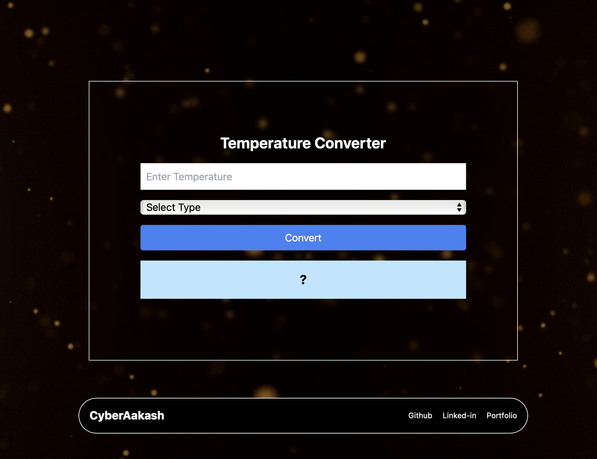

# Temperature Converter

A simple temperature converter web application built with React and Tailwind CSS.

## Table of Contents

- [Introduction](#introduction)
- [Features](#features)
- [Getting Started](#getting-started)
  - [Prerequisites](#prerequisites)
  - [Installation](#installation)
- [Usage](#usage)
- [Project Structure](#project-structure)
- [Built With](#built-with)
- [Acknowledgements](#acknowledgements)

## Introduction

This project is a temperature converter that allows users to input a temperature value and select the unit (Celsius or Fahrenheit). The application then converts the temperature to the other unit and displays the result.



## Features

- Convert temperatures between Celsius and Fahrenheit.
- Responsive design for mobile, tablet, and desktop.

## Getting Started

### Prerequisites

Make sure you have Node.js and npm installed on your machine.

- Node.js: [https://nodejs.org/](https://nodejs.org/)
- npm: [https://www.npmjs.com/](https://www.npmjs.com/)

### Installation

1. Clone the repository:

   ```bash
   git clone https://github.com/your-username/temperature-converter.git

2. Navigate to the project directory:

   ```bash
   cd temperature-converter

3. Install dependencies:

   ```bash
   npm install


### Usage

1. Start the development server:

   ```bash
   npm start

2. Open your browser and navigate to http://localhost:3000.

3. Use the temperature converter by entering a temperature value, selecting the unit, and clicking the "Convert" button.


### Project Structure

* src/: Contains the source code for the React application.
** components/: React components, including the Temp temperature converter component.
**App.js: Main application component.
**index.js: Entry point of the application.

  
### Built With

* React - JavaScript library for building user interfaces.
* Tailwind CSS - A utility-first CSS framework.

### Acknowledgements

* OpenAI GPT-3 - Used for generating README content.
* Next.js - React framework for building server-side rendered and static web applications.


